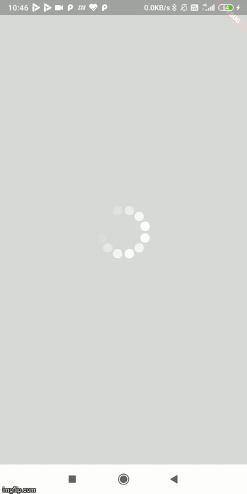

# Flutter-Weather-App
An app that can tell the weather conditions of the current region that you are present in with the help of data from your GPS. And can also take in input of city names to display the weather conditions for them too.

API to access the weather from each city and the current location was provided by openweathermap.org

### DEMO

